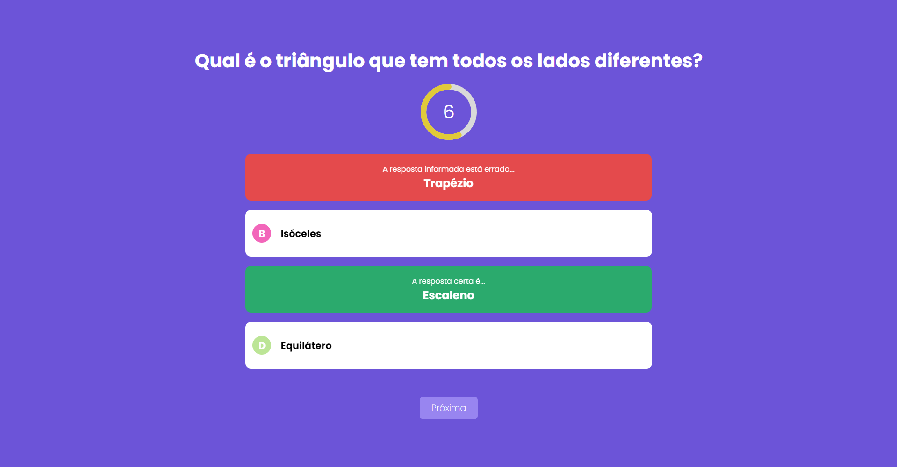
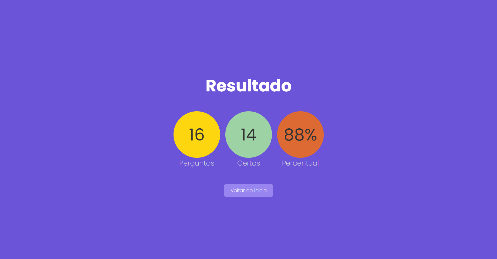

    <h1>Quiz utilizando Next.Js e TypeScript</h1>

  

  

## Sobre
A aplicação funciona no formato de Quiz onde será apresentado ao usuário perguntas de múltipla escolha para serem respondidas. Após respondido todas as perguntas, será exibido a tela de resultado com a quantidade e porcentagem de acerto.

## Tecnologias utilizadas
* Next 13.5.4
* React ^18
* Typescript 5.2.2

## Link da aplicação

[quiz-next-ts.vercel.app](https://quiz-next-ts.vercel.app/)

## Para executar

1. `git clone https://github.com/davirsreis/quiz-next-ts.git`
2. `cd quiz-next-ts`
3. `npm install`
4. `npm run dev`
